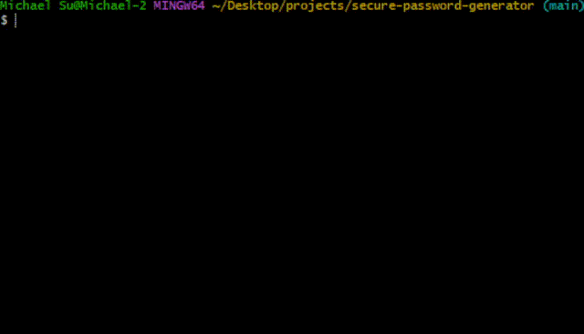

# secure-password-generator



# Secure Password Generator and Strength Analyzer

## Overview
This project is a command-line tool for generating secure passwords and analyzing their strength. It uses cryptographically secure methods to generate passwords and evaluates strength based on length, complexity, and checks against common breached passwords. Built with modularity in mind, it demonstrates foundational cybersecurity principles like entropy and breach detection, inspired by NIST guidelines, Sec+ certification, and TryHackMe labs.

## Features
- Generate passwords with customizable length, inclusion of character types (uppercase, lowercase, digits, symbols), and exclusion options.
- Analyze password strength with a scoring system (0-100) considering length, complexity, and breached status.
- Uses a local subset of the RockYou breached password list for offline checks.
- Modular design with separate modules for generation and analysis.
- 100% test coverage using pytest.
- CLI interface for ease of use and security.

## Requirements
- Python 3.13.6
- Dependencies listed in `requirements.txt`:
  ```
  pytest==8.3.2
  coverage==7.6.1
  ```

## Setup
1. Clone the repository:
   ```
   git clone https://github.com/msuL9/secure-password-generator.git
   cd secure-password-generator
   ```
2. Create and activate a virtual environment:
   ```
   python -m venv venv
   venv\Scripts\activate
   ```
3. Install dependencies:
   ```
   pip install -r requirements.txt
   ```

## Usage
Run the tool via CLI with `python main.py`. Examples:

- Generate a password:
  ```
  python main.py generate --length 16 --include-uppercase --include-digits --include-symbols
  ```

- Analyze a password:
  ```
  python main.py analyze --password "YourPasswordHere"
  ```

Use `--help` for full options:
```
python main.py --help
```

## Testing
1. Run unit tests:
   ```
   pytest
   ```
2. Check coverage:
   ```
   coverage run -m pytest
   coverage report -m
   ```
Tests cover all functions, including edge cases like minimum length, breached matches, and character inclusion. Achieves 100% coverage.

## License

MIT License. See [LICENSE](LICENSE) for details.
